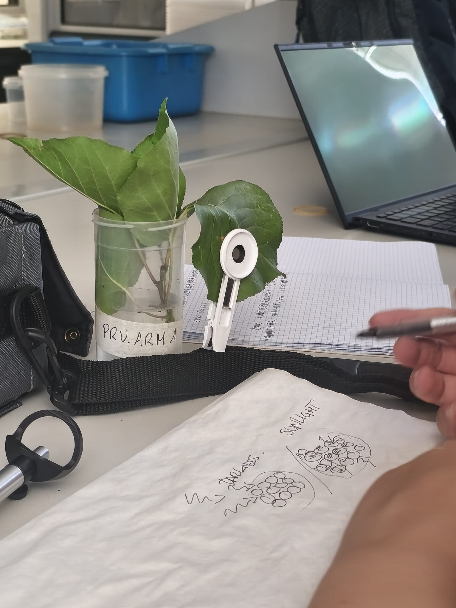
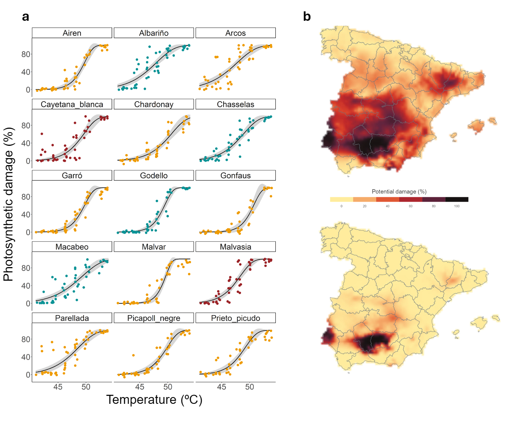
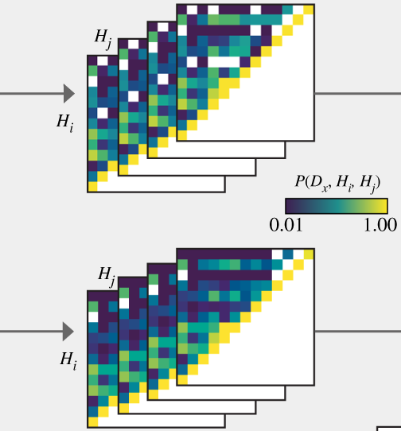

::: {.hero}

{.hero-logo height="70px"}

::: {.hero-content}

## MaCroPheST LAB

**Ma**croecological forecasting of **Cro**p-pest **Phe**nology across **S**pace and **T**ime

:::
:::

::: {.intro-section}

# Project overview

The biological impacts of climate change will have major implications for ecosystem functioning and stability. With rising global temperatures many species are shifting geographically, moving their distributions northward and higher in altitude, and temporally, experiencing recurring life-history events earlier in time.

These shifts have cascading effects on ecosystem services including food supply, increasingly threatened by pests that thrive under warmer conditions.

In this context, accurate ecological forecasts are urgently needed for both mitigation and human adaptation to future warming.

:::

::: {.home-research-band}
## Research lines

Four complementary research lines combining thermal biology, macroecology, and pest forecasting.

::: {.home-research-grid}

::: {.home-research-card}

::: {.home-research-avatar}
.jpg)
:::
## [Data science](research_data.qmd){.stretched-link}

Our group compiles published data on distribution and thermal biology of fruit crops and their insect pests.
:::

::: {.home-research-card}
::: {.home-research-avatar}

:::
## [Thermal tolerance and performance](research_thermal.qmd){.stretched-link}

We carry out experiments in the lab to experimentally determine the thermal tolerance of multiple fruit crop species and varieties.
:::

::: {.home-research-card}
::: {.home-research-avatar}

:::

## [Forecasting](research_forecast.qmd){.stretched-link}

We use physiological data from the literature and from our experiments to predict the spatial and temporal patterns of fruit trees and their pests.
:::

::: {.home-research-card}
::: {.home-research-avatar}

:::

## [Interaction networks](research_networks.qmd){.stretched-link}

Exploring the sharing of pests among different crop species from a probabilistic framework based on spatial and temporal forecasted co-occurrences.
:::

[See all research lines →](projects.qmd){.home-band-cta}
:::
:::

::: {.home-news-band}
## News

Latest news and updates from the group.

[See all news →](news.qmd){.home-hero-link}
:::