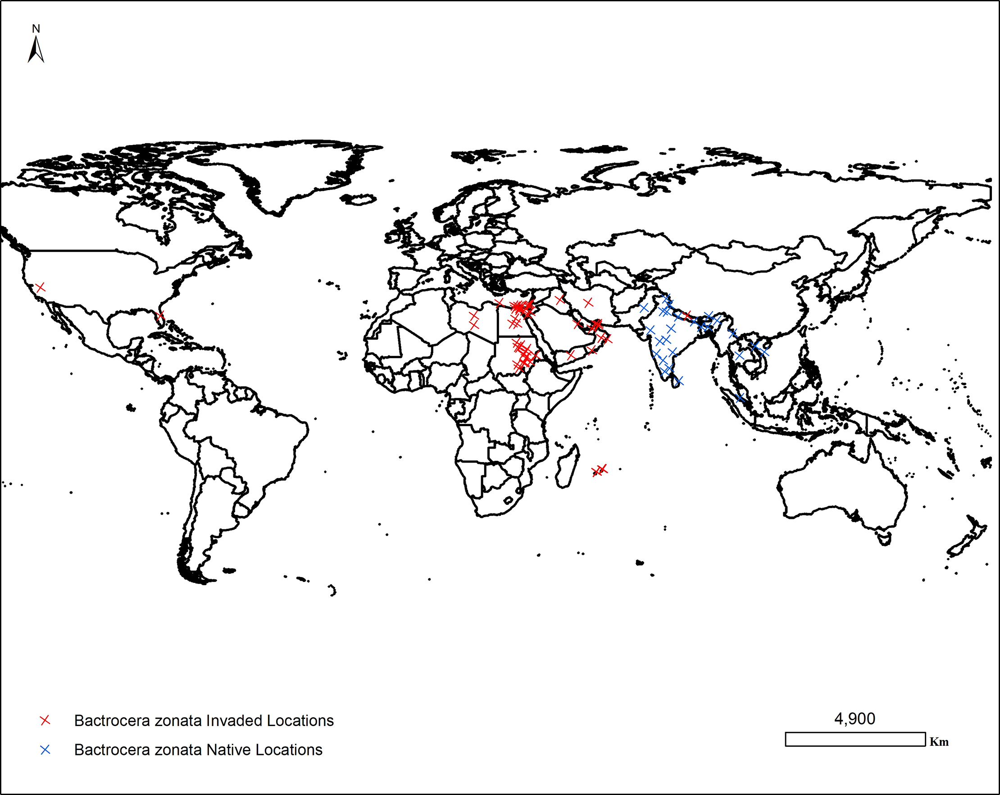
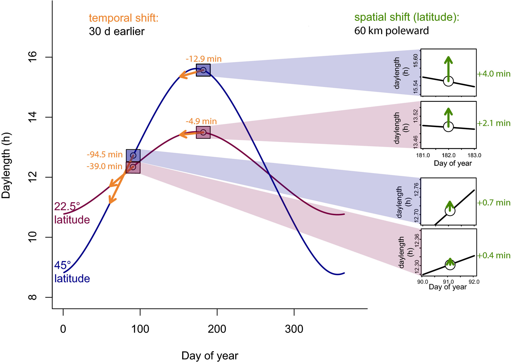
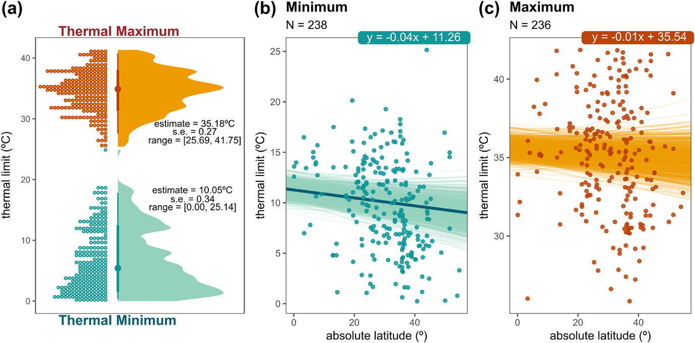

:::: project-hero
# Data science for crops and their pests

.jpg)

::: project-body
We aim to search, compile, normalize, and standardize available data on the distributions, phenologies, and temperature-induced physiological responses of crops and pests. Despite being mostly available for many highly relevant crops and major pests, these data are dispersed in the literature and not easily accesible and leverageable for forecasting purposes.

::: reveal
### Crops spatial distribution:

We are documenting and generating maps of fruit crops distributions at the European-scale (presence/absence data, at 10-km grid-cell resolution, and cropped hectares, at fine administrative level resolution). Two datasets have already been generated by the group members:

- *Global Wine Regions* (Morales-Castilla et al. 2019), which assembles the winegrape growing regions all at detailed polygons across the world.

- *CropMED Dataset* (San-Segundo Molina, D.; Villén-Pérez, S; Morales-Castilla, I. 2026), which compiles hectares of 142 unique crops across 1,705 administrative units of 47 countries in Europe, the Mediterranean region, and the Levant.

Beyond distributions, we will collect in the future historical data series on yield values and growing seasons for selected crops, from institutional data sources such as FAOStat Agricultural production statistics, and EuroStat.

:::

::: reveal

### Pests spatial distribution:

MaCroPheST compiles information from previous literature (e.g., Bebber et al. 2013, Ristaino et al. 2021, Savary et al. 2019), institutional data outlets—e.g., EPPO, CABI—which provide information on the geographical distribution of pest species, and other distribution data bases (e.g., GBIF, BOLDSystems). Our project has already collected distribution data from multiple sources for the top-25 most frequently intercepted pest species at European seaports, which is intended to complement forecasts (see the [Forecast research line page](research_forecast.qmd)).

:::

::: reveal

### Crop and pests temporal distributions (phenology):

For each major fruit crop we estimate its growing season and harvest periods (at a minimum monthly resolution) from data previously published by the work team (see the OSPREE dataset; Wolkovich et al. 2019) along with an exhaustive review of the published literature for country-specific harvest dates.

:::

::: reveal

### Crop and pests thermal responses:

Our team carries out comprehensive systematic reviews to scan the scientific evidence on the thermal tolerance and thermal performance of multiple crops and their pests collected after decades of experimental biology laboratory essays. For pests, the team has already collected a dataset for population rates variation across temperatures comprising \>200 species (San-Segundo Molina, Morales-Castilla & Villén-Pérez, 2026) and another one compiling the thermal responses of multiple biological rates for major quarantine pests.

:::

:::
::::
