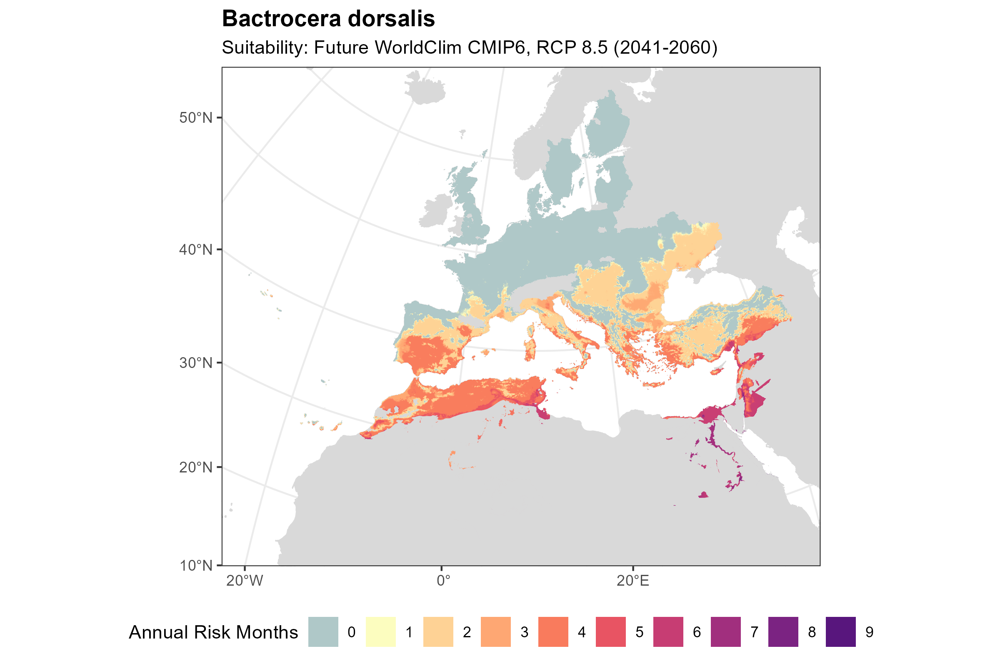
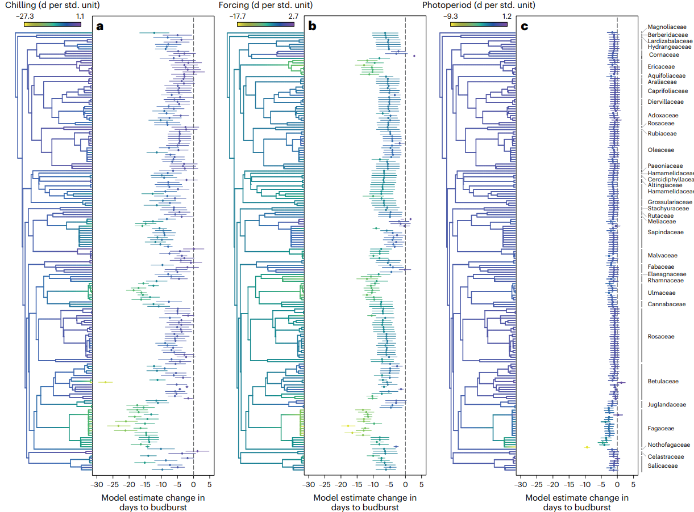

:::: project-hero
# Forecasting spatial-temporal distribution of fruit trees and their pests

::: project-body
Using experimental data collected from the literature (see [Data Science Research page](research_data.html)) and thermal tolerance and thermal performance responses estimated under our laboratory essays (see [Thermal tolerance and Performance Research page](research_thermal.html)), our group elaborates spatial and temporal forecasts. These predictions are typically projected to both current and future (warming scenarios) climates. 

::: reveal
### Forecasting damage on leaves by heat events:

We fit curves of photosynthetic damage on leaves of multiple Mediterranean and temperate fruit species estimated under laboratory experiments with heat baths (from previous work of the group on winegrape, see figure below). We then aim to project the potential damage of heat events under different warming scenarios across the growing regions of each crop to determine where and when major crop yield losses are expected.

:::

::: reveal
### Forecasting climatic suitability of both pests and crops:

Using fitted thermal performance curves for multiple pests species potentially affecting fruit orchards in the Mediterranean region and Europe, our project works on pest risk assessments identifying the climatic suitability of these regions under different climatic scenarios, seasons and host crop availability.

:::

::: reveal
### Forecasting phenological shifts:

Using experimental data from the literature and from experiments, our group projects how the temporal distribution of crop growing seasons and target pest life stages are expected to shift under warming scenarios. These predictions are useful for decision-support tools for calendar purposes based on physiological responses rather than on fixed dates, as well as for integrated pest management (e.g., apply biocontrol or pesticides when they really matter instead of arbitrary dates).

:::

::::
