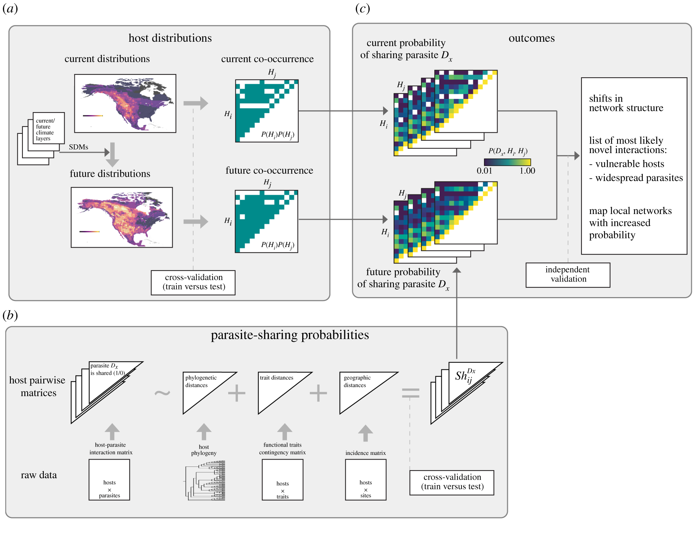

:::: project-hero

::: project-body

::: reveal

### Estimating thermal performance and thermal tolerance traits for fruit crops and their pests

To explore the sharing of pests among different crop species, we  analyze the overlap in pest 
occurrence across different crops using the developed pest suitability models following the 
probabilistic procedure developed by Morales-Castilla et al. (2021) (see figure above). Rather than focused on strict spatial co-occurrence, as originally formulated, here we modify the probabilistic framework to 
consider temporal co-occurrence. To build the meta-network of plant-pest species interactions, we will use data from recorded interactions outside Europe given that host plants of target pest species are well established in the literature and institutionally. This meta-web of known interactions will include species other than fruit crops (i.e., tree forest species and crops not included in our target species).

:::
:::
::::

