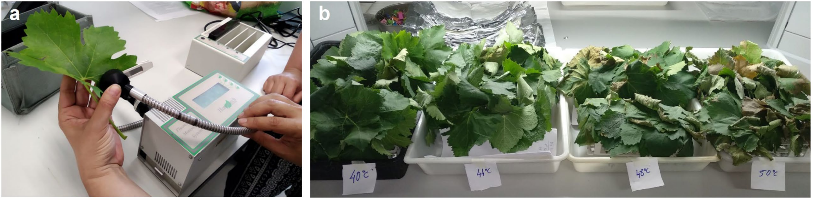

:::: project-hero

::: project-body

::: reveal

# Estimating thermal performance and thermal tolerance traits for fruit crops and their pests

In this project, we are carrying out experiments where leaves of 21 Mediterranean and temperate fruit tree species are exposed to increasingly hotter temperatures under water, to simulate the effects of heat waves peak temperatures on the physiological performance of the plant under no hydric stress conditions. Photosynthetic efficiencies are measured using a fluorimeter before each bath and 24h after. These data are then used to fit thermal curves or thermal-stress profiles that are useful to project damage under warming scenarios from a mechanistic approach (see [Forecasts Research page](research_forecasts.html)).  
:::
:::
::::